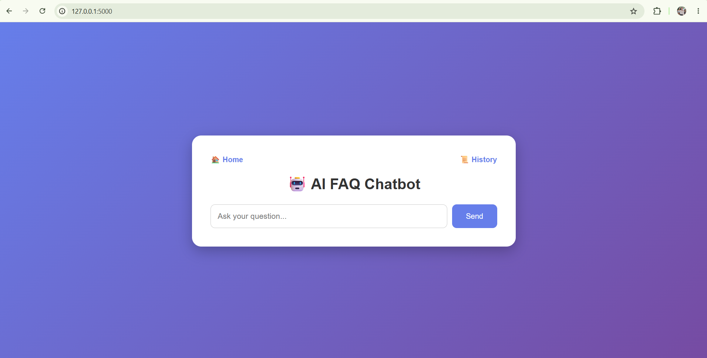
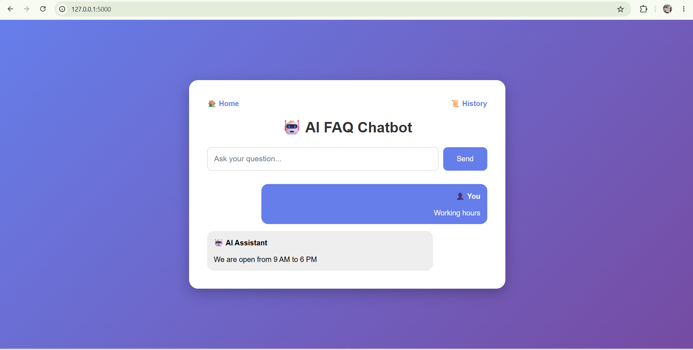
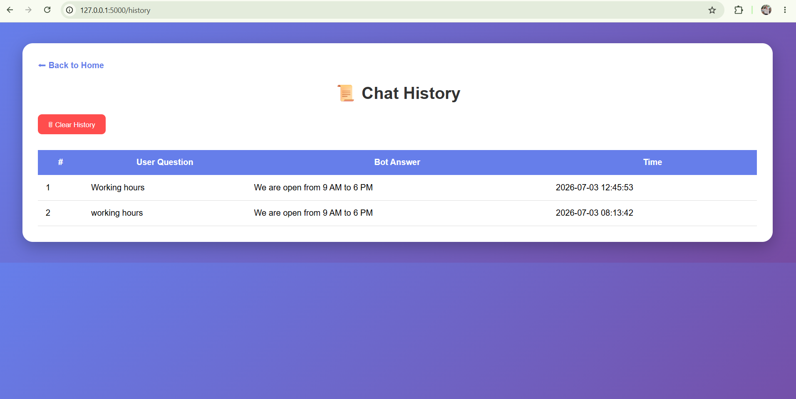

# 🤖 AI FAQ Chatbot

## 📌 Overview
AI FAQ Chatbot is a customer support chatbot built using Python, Flask, SQLite, NLTK, and Sentence Transformers. It answers frequently asked questions using semantic search and stores chat history.

---

## 🚀 Features

- AI-powered FAQ chatbot
- Semantic search using Sentence Transformers
- NLTK text preprocessing
- SQLite database
- Chat history
- Clear history feature
- Responsive UI using Flask

---

## 🛠 Technologies Used

- Python
- Flask
- SQLite
- NLTK
- Sentence Transformers
- HTML
- CSS

---

## 📂 Project Structure

AI-ChatBot/

├── app.py

├── chatbot.py

├── create_db.py

├── download_nltk.py

├── view_logs.py

├── faq.db

├── requirements.txt

├── README.md

├── templates/

│ ├── index.html

│ └── history.html

---

## ▶️ How to Run

1. Clone the repository

```
git clone <repository-url>
```

2. Install dependencies

```
pip install -r requirements.txt
```

3. Run database

```
python create_db.py
```

4. Run application

```
python app.py
```

5. Open browser

```
http://127.0.0.1:5000
```

---

## 📸 Screenshots

### 🏠 Home Page



---

### 💬 Chatbot Response



---

### 📜 Chat History


## 👩‍💻 Author

**Manisha Shah**